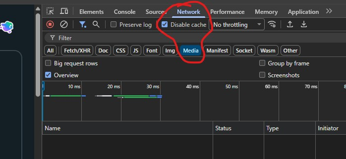
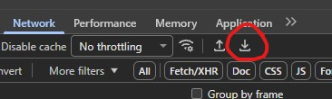
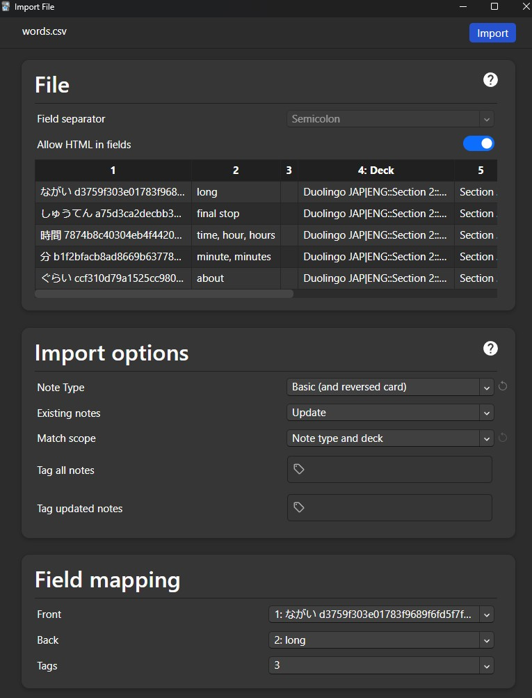

# Duolingo Course Word Extractor & Audio Generator

Extracts **all words** from your Duolingo course → generates **audio files** → creates **Anki-ready CSV**.

## ✨ Features

- 🔄 **Automatically loads ALL words** from Duolingo Practice Hub → extracts every vocabulary item you've learned
- 🎵 **Grabs pronunciation audio** → saves as `.mp3` files (from browser network capture)
- 📱 **Anki-ready output** → CSV + MP3 files formatted for direct import (Basic + reversed cards)
- ⚡ **Single click** in Tampermonkey → downloads complete word list automatically

## 🚀 Usage

1. Use Google Chrome and install [Tampermonkey](https://chromewebstore.google.com/detail/tampermonkey/dhdgffkkebhmkfjojejmpbldmpobfkfo).
2. Import the [userscript.js](userscript.js) script in Tampermonkey.
3. Go to [https://www.duolingo.com/practice-hub/words](https://www.duolingo.com/practice-hub/words).
4. Press F12 and go to Network tab.
5. Check "Disable cache" and "Media". 

6. With the userscript active, left-click anywhere on the webpage. If this doesn't trigger anything in the browser console, check if the userscript is actually active.
7. Wait for the download dialog for the `words.csv`. This may take a minute depending on how many words you have unlocked.
8. Safe `words.csv` to this directory next to the `createAudio.py`.
9. In the Network tab, on the top-right click the download icon and download as "network.har". 

10. Safe `network.har` to this directory next to the `createAudio.py`.
11. Run the `createAudio.py` script.
    When running this script a second time, first remove the already existing audio files in `/audio_files`.
12. Copy the column from the `audio_filenames.csv` and paste it into the `words.csv` in column I (filename).
13. In columns E and F, adjust the sections and units according to your best of knowledge if you want to have a more structured deck.
14. In columns A, B and D from row 4, remove the leading apostrophes to activate the formulas and adjust the LANG|LANG in coulmn D according to your languages. Then drag the three cells down to apply the formulas to all rows and save the file.
15. Place the mp3 files in the Anki collection.media folder, which should be in `C:\Users\USERNAME\AppData\Roaming\Anki2\Benutzer 1\collection.media` [Documentation](https://docs.ankiweb.net/importing/text-files.html#importing-media).
16. Import the `words.csv` into Anki. Field Separator should be Semicolon, HTML should be allowed, Note Type should be "Basic (and reversed card)", Existing notes should be Updated with Match scope of "Note type and deck". 

## 🛠️ Requirements

| Tool | Version |
|------|---------|
| [Google Chrome](https://www.google.com/chrome/) | 141+ |
| [Tampermonkey](https://chromewebstore.google.com/detail/tampermonkey/dhdgffkkebhmkfjojejmpbldmpobfkfo) | 5.4.1+ |
| [Anki Desktop](https://apps.ankiweb.net/#downloads) | 25.09+ |
| [Python](https://www.python.org/) | 3.11.9+ |

## 📄 License

See [LICENSE](LICENSE) - Free to copy, modify, distribute.